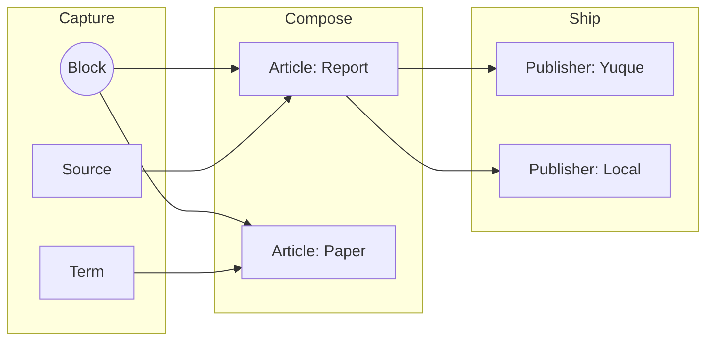
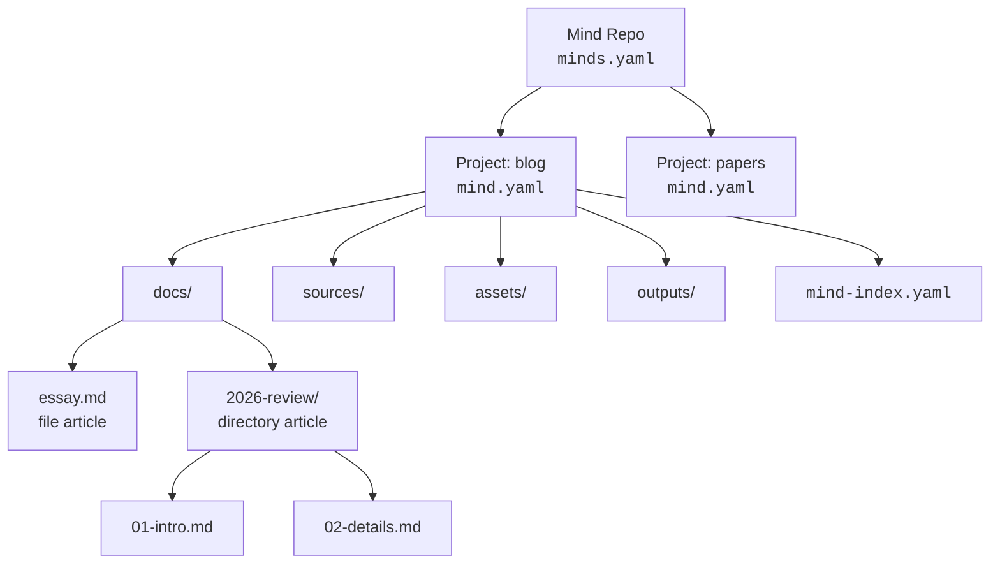
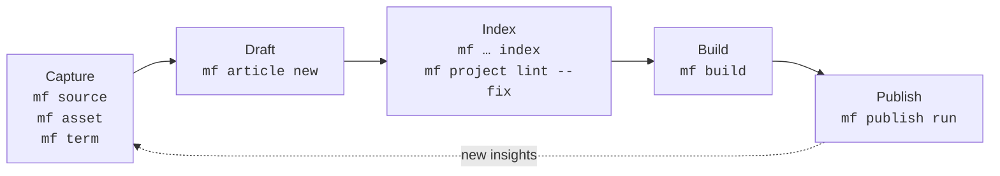

# mind-forge

**A local-first, AI-native CLI for card-based writing.**

`mf` treats your knowledge base as a codebase. Articles are assembled from
composable Blocks, every piece of state lives in plain files on disk, and the
CLI is shaped so both humans and Agents can drive it.

## Philosophy

Three ideas guide every decision in `mf`:

### Diffusion

Knowledge is meant to spread. Capture it once as a Block, then let it
diffuse — through articles, glossary terms, builds, and downstream
publishers like Yuque or static sites. The same atomic unit can land in a
report today and a paper tomorrow, without copy-paste drift.



### DaC — Document as Code

Your writing follows the same discipline as your infrastructure:

declarative YAML configs (`minds.yaml`, `mind.yaml`, `mind-index.yaml`),
schema validation, deterministic builds, and full git auditability.
If you can review a PR, you can review a chapter.

### AI Native CLI

`mf` is designed first for AI Agents, not for human terminal sessions.
Every command speaks a JSON envelope (`{ status, command, data }`), exits
with stable codes, and produces deterministic output contracts.
Build a pipeline with shell, Make, or an LLM — the contract is the same.

This is an independent philosophy, not a subset of DaC: AI Native CLI
rejects interactive prompts, colored output designed for human eyes, and
inconsistent exit codes. The tool is a reliable API for an LLM to call.

Local-first underpins all three: no cloud, no lock-in, plain markdown and
YAML you can edit in any editor.

## Install

Requires Rust 1.75+.

```bash
git clone https://github.com/alswl/mind-forge.git
cd mind-forge
cargo install --path .
```

Or run from source while iterating:

```bash
cargo run -- --help
```

Shell completion:

```bash
mf completion zsh   # or bash | fish | powershell | elvish
```

## Quick Start

```bash
# 1. Create a Mind Repo
mkdir my-repo && cd my-repo
mf init                                # creates minds.yaml + projects/

# 2. Create a project (path-based identity, Unicode/emoji/dates supported)
mf project new blog
mf project new workspaces/team/projects/2026-W21

# 3. Create an article
mf article new "First Post" --project blog

# 4. Add sources, assets, and terms
mf source add https://example.com/ref --file-kind web --project blog
mf asset add diagram.png --project blog
mf term new "Zettelkasten" --definition "A note-taking method" --project blog

# 5. Index, build, and publish
mf article index --project blog
mf build "First Post" --project blog
mf publish run "First Post" --target local --project blog
```

## Core Concepts

| Concept          | What it is                                                                 |
| ---------------- | -------------------------------------------------------------------------- |
| **Mind Repo**    | A directory rooted at `minds.yaml`. The outermost unit of organization.    |
| **Project**      | A subdirectory with `mind.yaml`. Default layout: `docs/`, `sources/`, `assets/`, `outputs/`. |
| **Article**      | A document — either a single Markdown file or a directory of ordered files. |
| **Block**        | An atomic, reusable unit of content composed into articles.                |
| **Source**       | An external reference (web page, PDF, RSS feed, file) tracked per project. |
| **Asset**        | A binary or non-text resource attached to a project.                       |
| **Index**        | `mind-index.yaml` per project — the source of truth for everything above.  |
| **Publisher**    | A target (e.g. `local`, `yuque-prompt`) that ships built output somewhere. |

All on-disk YAML follows the mind 0.3.0 format (`schema: "1"`), so repos move
freely between `mf` and other mind-compatible tools.

How the pieces fit on disk:



## Workflow

A typical loop:



1. **Capture** — `mf source add` and `mf asset add` pull raw material into a
   project. `mf term new` records vocabulary.
2. **Draft** — `mf article new <TYPE> <TITLE> [--template <S>] [--file]`
   scaffolds a directory article (default) or single file (`--file`) under
   `docs/`. The default template is `blank`; `--template arch|prd|blog`
   selects another built-in scaffold, and `--template <path>` reads a
   project-local Markdown template. New articles automatically get Typora
   front matter (`typora-copy-images-to`) pointing to the project assets
   directory (disable with `plugins.typora-front-matter.enabled: false` in
   `mind.yaml`). Edit in any Markdown editor.
3. **Index** — `mf source index`, `mf article index`, and
   `mf project lint --fix` reconcile `mind-index.yaml` with the filesystem.
4. **Build** — `mf build <article>` assembles output (directory articles
   merge their files in filename order) into `outputs/<article>.md`.
5. **Ship** — `mf publish run … --target <publisher>` pushes to a configured
   target.

Every step is idempotent and pipe-friendly. Pass `--json` to any command to
get a machine-readable envelope.

## Command Reference

### Flags

These flags are available on most commands:

| Flag | Description |
|------|-------------|
| `--root <PATH>` | Mind Repo root directory |
| `--config <PATH>` | Config file path |
| `-p`, `--project <PROJECT>` | Project selector for project-scoped commands |
| `-v`, `--verbose...` | Verbose output (repeatable) |
| `-q`, `--quiet` | Silence non-error output |
| `--format <text\|json>` | Output format (default: `text`) |
| `--json` | Shorthand for `--format json` |
| `--no-color` | Disable colored output |
| `-h`, `--help` | Show help |
| `-V`, `--version` | Show version |

Shared flag families (uniform across all commands they apply to):

| Flag family | Applies to | Description |
|------|------|------|
| `--dry-run` | every mutating command (`new`, `add`, `rename`, `remove`, `archive`, `update`, `index`, lint `--fix`) | Preview without writing |
| `-f`, `--force` | every `new`/`add`/`rename`/`remove`/`archive` | Overwrite or skip safety checks |
| `-y`, `--yes` | every `remove` and `archive` | Confirm destructive action non-interactively |
| `--no-headers`, `--no-trunc` | every `list` | Suppress table header / disable column truncation |
| `--fix`, `--rule <RULE>`, `--severity <LEVEL>`, `--max-warnings <N>` | every `lint` | Auto-fix, restrict rule, filter severity, fail on warnings > N |

`--project` is available on project-scoped commands (`article`, `asset`,
`source`, `term`, `build`, `publish run`, etc.) and accepts repo-relative
paths or project names. When running inside a project directory,
`--project` can be omitted — the CLI auto-detects the current project.

### `mf init [PATH]` — Initialize a Mind Repo

Bootstrap a directory as a Mind Repo (creates `minds.yaml` and the
default `projects/` container). Defaults to the current directory.

### `mf project` — Manage projects

| Subcommand | Description |
|-----------|-------------|
| `new <PATH>` | Create a project. Accepts cwd-relative or repo-relative paths with Unicode, emoji, dates, spaces. `--template <TEMPLATE>` |
| `list` (ls) | List projects |
| `show <NAME>` | Show project details |
| `rename <OLD> <NEW>` | Rename a project |
| `remove <NAME>` (rm) | Remove a project (interactive confirmation in TTY) |
| `archive <NAME_OR_PATH>` | Archive a project to `_archived/` (interactive confirmation in TTY) |
| `lint` | Lint project(s). Rules: `missing_directory`, `stale_index_entry`, `name_convention`, `missing_manifest`, `duplicate_key`. Requires `-p, --project <PROJECT>` |
| `index` | Index projects (mf extension) |
| `import <DIRECTORY>` | Import a directory as a project. `--type <TYPE>`, `--source <DIR>`, `--assets <DIR>`, `-y, --non-interactive` |

### `mf article` — Manage articles

| Subcommand | Description |
|-----------|-------------|
| `new <TITLE>` | Create an article. `-t, --template blank\|arch\|prd\|blog\|<path>`, `--file`, `--tag <TAG>`, `--draft` |
| `list` (ls) | List articles |
| `show <PATH>` | Show article details |
| `rename <OLD_PATH> <NEW_PATH>` | Rename an article |
| `remove <PATH>` (rm) | Remove an article (interactive confirmation in TTY) |
| `lint` | Lint articles |
| `convert` | Convert article shape between directory and single-file. `--to-single-file`, `--to-directory`, `--dry-run` |
| `index` | Index articles (mf extension). Also `-n` short for `--dry-run` |

### `mf source` — Manage content sources

| Subcommand | Description |
|-----------|-------------|
| `add <INPUT>` | Add a source. `-n, --name <NAME>`, `--file-kind auto\|pdf\|file\|rss\|web`, `--source-kind yuque\|meeting\|misc`, `--link` |
| `list` (ls) | List sources. `--filter <PATTERN>`, `-t, --type <KIND>` |
| `show <NAME>` | Show source details |
| `update <NAME>` | Update a source (mf extension). `--url <URL>`, `--rename <NAME>` |
| `rename <OLD_PATH> <NEW_PATH>` | Rename a source |
| `remove <NAME_OR_PATH>` (rm) | Remove a source. `--keep-file` |
| `index` | Index sources (mf extension) |
| `clean` | Clean stale index entries |

### `mf asset` — Manage project assets

| Subcommand | Description |
|-----------|-------------|
| `add <PATH>` | Add an asset. `--name <NAME>`, `--tag <TAG>`, `--copy`/`--link` |
| `list` (ls) | List assets. `--filter <PATTERN>`, `--type image\|video\|audio\|other` |
| `show <NAME>` | Show asset details |
| `update [PATH]` | Update assets. `--set-url <URL>`, `--channel <CHANNEL>`, `--all` |
| `rename <OLD_PATH> <NEW_PATH>` | Rename an asset |
| `remove <FILE>` (rm) | Remove an asset |
| `index` | Index assets (mf extension). `--refresh-metadata` |
| `clean` | Clean stale index entries |

### `mf term` (alias: `mf terms`) — Manage terminology

| Subcommand | Description |
|-----------|-------------|
| `new <TERM>` | Create a term (mf extension). `--definition <TEXT>`, `--description <TEXT>`, `--confidence <N>`, `--alias <TEXT>`, `--tag <TAG>`, `--misrecognition <TEXT>` |
| `list` (ls) | List terms. `--filter <PATTERN>`, `--term <NAME>` (deprecated: use `show`) |
| `show <NAME>` | Show term details |
| `add` | Add a term correction (mind primary; previously `learn`). `--term <CANONICAL>`, `--alias <VARIANT>` |
| `update <TERM>` | Update term metadata (mf extension; previously `fix`). `--definition <TEXT>`, `--description <TEXT>`, `--confidence <N>`, `--alias <TEXT>`, `--tag <TAG>`, `--clear-description`, `--clear-confidence` |
| `rename <OLD> <NEW>` | Rename a term. `--keep-alias` keeps the old name as an alias |
| `remove <TERM>` (rm) | Remove a term (interactive confirmation in TTY) |
| `lint [PATH]` | Lint term consistency in project docs |

Global terms (created without `--project`) are stored in `minds-terms.yaml` at
the repo root. Project-scoped terms live in each project's `mind-index.yaml`.

### `mf build <ARTICLE>` — Build articles

`-o, --output <PATH>`, `--dry-run`. `ARTICLE` may be an indexed name/slug or
a repo-relative path prefixed with `@` (e.g. `@projects/blog/docs/2026-03-review/`).
Directory articles are built by merging Markdown files in filename order.

### `mf publish` — Publish articles & manage targets

| Subcommand | Description |
|-----------|-------------|
| `run <ARTICLE>` | Publish to a target (supported: `local`, `yuque-prompt`). `--target <TARGET>` |
| `update <ARTICLE>` | Update a publish record. `--target <TARGET>` (required), `--status draft\|published\|archived`, `--target-url <URL>`, `--set <KEY=VALUE>` |
| `target list` | List publish targets and diagnostics |
| `target show <NAME>` | Show publish target details |

### `mf render template` — Render templates

| Subcommand | Description |
|-----------|-------------|
| `list` | List built-in and project-local render templates |
| `show <NAME>` | Show template details + preview |

### `mf config` — Manage configuration

| Subcommand | Description |
|-----------|-------------|
| `schema` | Show config JSON schema. `--output-format json\|yaml` (default: `json`) |
| `show` | Show effective config (canonical JSON envelope). `--output-format json\|yaml` (default: `yaml`) |
| `generate` | Generate effective config file. `--output-format json\|yaml` (default: `yaml`), `-o, --output <PATH>` |
| `default` | Show default config values. `--output-format json\|yaml` (default: `yaml`) |
| `init` | **Deprecated:** use `mf init`. `--output <PATH>`, `--target project\|repo` (default: `project`), `--force` |

### `mf completion <SHELL>` — Generate shell completion

Supported shells: `bash`, `zsh`, `fish`, `powershell`, `elvish`

### `mf version` — Show version information

Text output includes commit / build_date / rustc. JSON envelope adds
`target_triple`. Pass `--json` for the machine-readable form.

## Features

- **Repo bootstrap** — `mf init [PATH]` creates `minds.yaml` and `.mind/`
- **Project lifecycle** — `mf project new | list | show | rename | remove | archive | lint | index | import`; path-based identity supports Unicode, emoji, dates, spaces
- **Project auto-detection** — running inside a project directory auto-injects `--project`; cwd-relative paths normalized to repo-relative canonical identity
- **Article management** — `mf article new | list | show | rename | remove | lint | index`; directory articles by default, `--file` for single-file shape; `--template blank|arch|prd|blog` or custom project-local template path
- **Sources** — `mf source add | list | show | update | rename | remove | index | clean`; `--file-kind auto|pdf|file|rss|web`, `--source-kind yuque|meeting|misc`
- **Assets** — `mf asset add | list | show | update | rename | remove | index | clean`; `--copy`/`--link` for copy vs symlink
- **Glossary** — `mf term new | list | show | add | update | rename | remove | lint`; global terms in `minds-terms.yaml`, project-scoped in `mind-index.yaml`
- **Build** — config-driven assembly, directory-article merging, `--dry-run`, `--output`, and `@path/`-style article addressing
- **Publish** — `mf publish run | update | target list | target show` against per-target publishers (`local`, `yuque-prompt`); project-level local targets resolve relative paths from project root
- **Render templates** — `mf render template list | show` covers built-in and project-local templates
- **Config** — `mf config schema | show | generate | default`; centralized defaults for `docs/`, `sources/`, `assets/`, `_archived/`, and `outputs/`
- **Plugins** — `mind.yaml` supports a `plugins` block for forward-compatible plugin configuration; the `typora-front-matter` plugin is enabled by default and injects `typora-copy-images-to` front matter into new articles
- **Compatibility** — reads and writes mind 0.3.0 YAML; tolerates older `schema_version` and list-based shapes on read
- **Shell completion** — `mf completion <SHELL>` for bash, zsh, fish, powershell, elvish
- **Version** — `mf version` includes commit / build_date / rustc / target_triple
- **Output contracts** — `text` by default, `--json` for `{ status, command, data }` envelopes; canonical per-verb shapes; identity round-trip between list and show; remove/archive use a TTY confirmation protocol; stable exit codes

## Output Contracts

Every `mf` command adheres to shared text-layout and JSON-envelope contracts. These are documented in the feature specification:

| Contract | Description |
|----------|-------------|
| [List layout](specs/039-list-output-redesign/contracts/list-layout.md) | Unified table format for all `mf <noun> list` commands |
| [Show layout](specs/039-list-output-redesign/contracts/show-layout.md) | Unified key-value block format for all `mf <noun> show` commands |
| [Verb envelopes](specs/039-list-output-redesign/contracts/verb-envelopes.md) | Per-verb JSON shapes (create, rename, remove, update, index, lint) |
| [Flag conventions](specs/039-list-output-redesign/contracts/flag-conventions.md) | Required flags every command must accept |
| [Confirmation protocol](specs/039-list-output-redesign/contracts/confirmation-protocol.md) | TTY-only interactive prompt for destructive verbs |

Key rules:
- `data` is always a JSON object — no bare arrays, strings, or `null`
- Text output adapts to TTY (headers + ANSI) vs pipe (no headers, no ANSI, same row shape)
- Every resource carries an `identity` field that round-trips between list and show
- `--dry-run` is available on every mutating command
- Remove and archive require confirmation in TTY; non-TTY exits 1 without `--yes`/`--force`

## Project Status

See [specs/](specs/) for detailed specifications and the feature evolution plan.

## License

[MIT](LICENSE)
