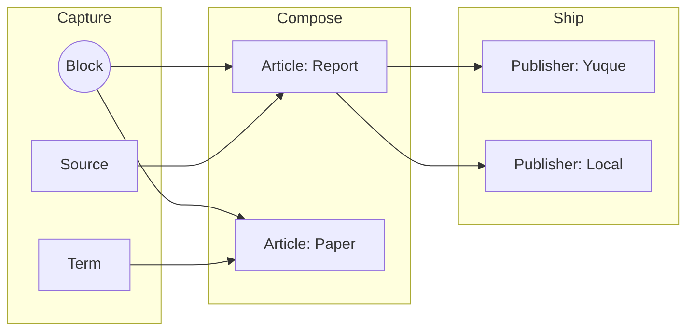
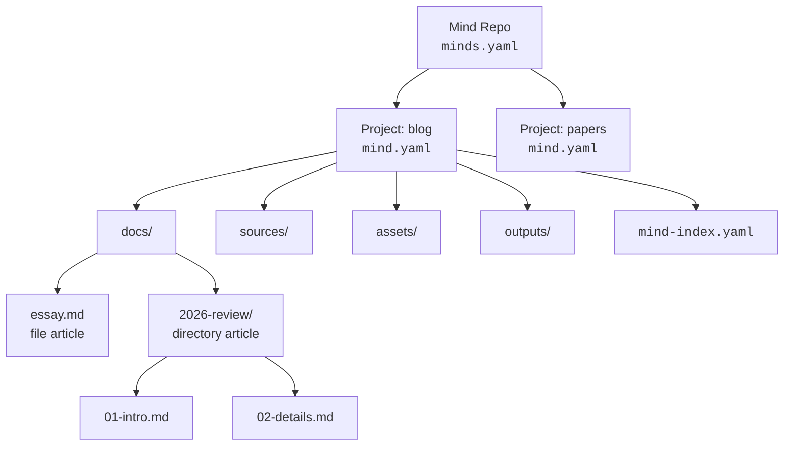
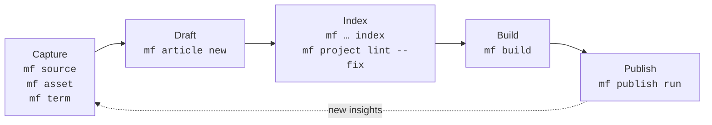

# mind-forge

**A local-first, AI-native CLI for card-based writing.**

`mf` treats your knowledge base as a codebase. Articles are assembled from
composable Blocks, authored content and configuration live in plain files on
disk, and the CLI is shaped so both humans and Agents can drive it. Features
may use explicitly specified repo-local embedded stores for advanced indexing
and retrieval without introducing a cloud dependency.

## Philosophy

Three ideas guide every decision in `mf`:

### Diffusion

Knowledge is meant to spread. Capture it once as a Block, then let it
diffuse — through articles, glossary terms, builds, and downstream
publishers like Yuque or static sites. The same atomic unit can land in a
report today and a paper tomorrow, without copy-paste drift.



### DaC — Document as Code

Your writing follows the same discipline as your infrastructure:

declarative YAML configs (`minds.yaml`, `mind.yaml`, `mind-index.yaml`),
schema validation, deterministic builds, and full git auditability.
If you can review a PR, you can review a chapter.

### AI Native CLI

`mf` is designed first for AI Agents, not for human terminal sessions.
Every command speaks a JSON envelope (`{ status, command, data }`), exits
with stable codes, and produces deterministic output contracts.
Build a pipeline with shell, Make, or an LLM — the contract is the same.

This is an independent philosophy, not a subset of DaC: AI Native CLI
rejects interactive prompts, colored output designed for human eyes, and
inconsistent exit codes. The tool is a reliable API for an LLM to call.

Local-first underpins all three: no required cloud service, plain Markdown and
YAML for authored content and configuration, plus portable migration paths for
any repo-local embedded stores.

## Install

Requires Rust 1.91+.

```bash
git clone https://github.com/alswl/mind-forge.git
cd mind-forge
cargo install --path .
```

Or run from source while iterating:

```bash
cargo run -- --help
```

Shell completion:

```bash
mf completion zsh   # or bash | fish | powershell | elvish
```

## Quick Start

```bash
# 1. Create a Mind Repo
mkdir my-repo && cd my-repo
mf init                                # creates minds.yaml + projects/

# 2. Create a project (path-based identity, Unicode/emoji/dates supported)
mf project new blog
mf project new workspaces/team/projects/2026-W21

# 3. Create an article
mf article new "First Post" --project blog

# 4. Add sources, assets, and terms
mf source new https://example.com/ref --file-kind web --project blog
mf asset new diagram.png --project blog
mf term new "Zettelkasten" --definition "A note-taking method" --project blog

# 5. Index, build, and publish
mf article index --project blog
mf build "First Post" --project blog
mf publish run "First Post" --target local --project blog
```

## Manual

See [docs/manual.md](docs/manual.md) for the full user manual, including repo
layout, shared CLI contracts, scripting patterns, and end-to-end workflows for
projects, articles, sources, assets, terms, builds, publishing, templates, and
configuration.

## Experimental: repository-wide Source RAG

`mf source advanced` is the experimental, repo-wide Source backend. Its data
directory is `.mind/source/advanced/`; it is local runtime state and should be
included in backups, not committed. Start from ordinary per-project Sources,
then inspect the planned activation before making any change:

```bash
# From the Mind Repo root
mf source advanced enable --dry-run
mf source advanced enable
mf source advanced sync --offline          # extract, chunk, and index content
mf source advanced status
mf source search "your query" --mode advanced
```

`basic` search matches registered Source metadata across the repository.
`advanced` search runs LanceDB's tokenized **BM25** full-text ranking over
synced content and works fully offline — no embedding model required. When the
embedding model is installed before `sync`, it additionally uses local vector
retrieval and hybrid ranking. See the manual's
[Advanced Source status](docs/manual.md#71-experimental-advanced-source-status)
for the exact boundary and safe commands.

### Embedding model (for semantic search)

Semantic search uses a repo-local embedding model, `intfloat/multilingual-e5-small`
(384-dim). It runs on **CPU via ONNX Runtime** — no GPU or VRAM, roughly a few
hundred MB of RAM, so it runs comfortably on a laptop (including Apple Silicon
MacBooks). `sync` and `search` never download it implicitly; install it once,
explicitly:

```bash
mf source advanced model install           # downloads from HuggingFace (~120 MB)
mf source advanced model status
```

Download notes:

- The download honors the standard `http_proxy` / `https_proxy` environment
  variables. For this environment, use `http://127.0.0.1:1235` for both.
- Mirrors: you can point at a mirror with `HF_ENDPOINT`
  (e.g. `export HF_ENDPOINT=https://hf-mirror.com`) before `model install`.
  Note that some mirrors redirect large LFS files (`onnx/model.onnx`) back to
  `huggingface.co`; if that host is blocked, the download still fails despite a
  reachable mirror host.
- Fully offline / restricted networks: obtain the model bundle on another
  machine and import it without any network access:

  ```bash
  mf source advanced model import /path/to/e5-small-bundle
  ```

## Core Concepts

| Concept          | What it is                                                                 |
| ---------------- | -------------------------------------------------------------------------- |
| **Mind Repo**    | A directory rooted at `minds.yaml`. The outermost unit of organization.    |
| **Project**      | A subdirectory with `mind.yaml`. Default layout: `docs/`, `sources/`, `assets/`, `outputs/`. |
| **Article**      | A document — either a single Markdown file or a directory of ordered files. |
| **Block**        | An atomic, reusable unit of content composed into articles.                |
| **Source**       | An external reference (web page, PDF, RSS feed, file) tracked per project. |
| **Asset**        | A binary or non-text resource attached to a project.                       |
| **Index**        | `mind-index.yaml` per project — the source of truth for everything above.  |
| **Publisher**    | A target (e.g. `local`, `yuque-prompt`) that ships built output somewhere. |

All on-disk YAML follows the mind 0.3.0 format (`schema: "1"`), so repos move
freely between `mf` and other mind-compatible tools.

How the pieces fit on disk:



## Workflow

A typical loop:



1. **Capture** — `mf source new` and `mf asset new` pull raw material into a
   project. `mf term new` records vocabulary.
2. **Draft** — `mf article new <TYPE> <TITLE> [--template <S>] [--file]`
   scaffolds a directory article (default) or single file (`--file`) under
   `docs/`. The default template is `blank`; `--template arch|prd|blog`
   selects another built-in scaffold, and `--template <path>` reads a
   project-local Markdown template. New articles automatically get Typora
   front matter (`typora-copy-images-to`) pointing to the project assets
   directory (disable with `plugins.typora-front-matter.enabled: false` in
   `mind.yaml`). Edit in any Markdown editor.
3. **Index** — `mf source index`, `mf article index`, and
   `mf project lint --fix` reconcile `mind-index.yaml` with the filesystem.
4. **Build** — `mf build <article>` assembles output (directory articles
   merge their files in filename order) into `outputs/<article>.md`.
5. **Ship** — `mf publish run … --target <publisher>` pushes to a configured
   target.

Every step is idempotent and pipe-friendly. Pass `--json` to any command to
get a machine-readable envelope.

## Command Reference

### Flags

These flags are available on most commands:

| Flag | Description |
|------|-------------|
| `--root <PATH>` | Mind Repo root directory |
| `--config <PATH>` | Config file path |
| `-p`, `--project <PROJECT>` | Project selector for project-scoped commands |
| `-v`, `--verbose...` | Verbose output (repeatable) |
| `-q`, `--quiet` | Silence non-error output |
| `-o`, `--output <text\|json>` | Output format (default: `text`) |
| `--json` | Shorthand for `--output json` |
| `--no-color` | Disable colored output |
| `-h`, `--help` | Show help |
| `-V`, `--version` | Show version |

Shared flag families (uniform across all commands they apply to):

| Flag family | Applies to | Description |
|------|------|------|
| `--dry-run` | every mutating command (`new`, `rename`, `remove`, `archive`, `update`, `index`, lint `--fix`) | Preview without writing |
| `-f`, `--force` | every `new`/`rename`/`remove`/`archive` | Proceed despite safety checks: overwrite an existing target, or remove an entity referenced by others |
| `-y`, `--yes` | every `remove` and `archive` | Confirm destructive action non-interactively |
| `--no-headers`, `--no-trunc` | every `list` | Suppress table header / disable column truncation |
| `--fix`, `--rule <RULE>`, `--severity <LEVEL>`, `--max-warnings <N>` | every `lint` | Auto-fix, restrict rule, filter severity, fail on warnings > N |

`--project` is available on project-scoped commands (`article`, `asset`,
`source`, `term`, `build`, `publish run`, etc.) and accepts repo-relative
paths or project names. When running inside a project directory,
`--project` can be omitted — the CLI auto-detects the current project.
When run outside a project directory without `--project`, `mf article list`
automatically matches all projects and sorts articles by most recently
modified.

### `mf init [PATH]` — Initialize a Mind Repo

Bootstrap a directory as a Mind Repo (creates `minds.yaml` and the
default `projects/` container). Defaults to the current directory.

### `mf project` — Manage projects

| Subcommand | Description |
|-----------|-------------|
| `new <PATH>` | Create a project. Accepts cwd-relative or repo-relative paths with Unicode, emoji, dates, spaces. `--template <TEMPLATE>` |
| `list` (ls) | List projects |
| `show <PATH>` | Show project details |
| `update <PATH>` | Update project metadata. `--description <TEXT>`, `--clear-description` |
| `rename <OLD_PATH> <NEW_PATH>` | Rename a project |
| `remove <PATH>` (rm) | Remove a project (interactive confirmation in TTY) |
| `archive <NAME_OR_PATH>` | Archive a project to `_archived/` (interactive confirmation in TTY) |
| `lint` | Lint project(s). Rules: `missing_directory`, `stale_index_entry`, `name_convention`, `missing_manifest`, `duplicate_key`, `orphan_prompt`, `duplicate_binding`, `missing_thinking`. Requires `-p, --project <PROJECT>` |
| `index` | Index projects (mf extension). Also reconciles each project's article index: prunes stale entries whose target file no longer exists on disk (entries with existing files — including declared/template articles — are never removed); per-project reconcile failures surface as warnings instead of being skipped silently |
| `import <DIRECTORY>` | Import a directory as a project. `--type <TYPE>`, `--source <DIR>`, `--assets <DIR>`, `-y, --yes` |

### `mf article` — Manage articles

| Subcommand | Description |
|-----------|-------------|
| `new <TITLE>` | Create an article. `-t, --template blank\|arch\|prd\|blog\|<path>`, `--file`, `--tag <TAG>`, `--draft` |
| `list` (ls) | List articles. Omitting `--project` outside a project dir lists all articles across all projects, sorted by most recently modified. In single-project mode each row also carries a `PROMPT` column (bound prompt's mode, `duplicate` on conflict, `-` if none) and a `THINKING` column (`yes`/`-`) |
| `show <PATH>` | Show article details, including bound prompt (path, mode, binding status, updated) and thinking ledger (path, updated) when present |
| `update <PATH>` | Update article metadata. `--status draft\|published` |
| `rename <OLD_PATH> <NEW_PATH>` | Rename an article |
| `remove <PATH>` (rm) | Remove an article (interactive confirmation in TTY). Accepts the title, the `article_path`, or the index key — with or without a trailing `.md`; all forms resolve to the same entry |
| `lint` | Lint articles |
| `convert` | Convert article shape between directory and single-file. `--to-single-file`, `--to-directory`, `--dry-run` |
| `index` | Index articles (mf extension). Also reconciles the `prompts:`/`thinking:` projections against `prompts/*.md`/`thinking/*.md` on disk in the same run (added/removed/kept counts per store in JSON). `--dry-run` previews without writing |

### `mf source` — Manage content sources

| Subcommand | Description |
|-----------|-------------|
| `new <INPUT>` | Add a source. `-n, --name <NAME>`, `--file-kind auto\|pdf\|file\|rss\|web`, `--source-kind yuque\|meeting\|misc`, `--link`, `--register-only` (index a file already inside the project's sources directory without copying it; idempotent; not combinable with `--link`/`--force`) |
| `list` (ls) | List sources. `--filter <PATTERN>`, `-t, --type <KIND>` |
| `show <PATH>` | Show source details |
| `update <PATH>` | Update a source (mf extension). `--url <URL>`, `--rename <NAME>` |
| `rename <OLD_PATH> <NEW_PATH>` | Rename a source |
| `remove <NAME_OR_PATH>` (rm) | Remove a source. `--keep-file` |
| `index` | Index sources (mf extension) |
| `clean` | Clean stale index entries |
| `search <QUERY>` | Search sources across all projects. `--mode basic\|advanced\|both`, `-p, --project <NAME>`, `--file-kind <KIND>`, `--source <NAME>`, `--limit <N>` |
| `advanced enable` | Activate LanceDB-backed repository Sources (imports all legacy registrations). `--dry-run` |
| `advanced sync` | Reconcile content for Source registrations. `-p, --project <NAME>`, `--offline`, `--dry-run` |
| `advanced model install` | Download and install the embedding model (requires network). `--model <ID>`, `--dry-run` |
| `advanced model import <DIR>` | Import a local model bundle (network-free). `--dry-run` |
| `advanced model status` | Report model installation status (read-only) |
| `advanced enrich list` | List pending/stale enrichment jobs for Claude Skill workflow |
| `advanced enrich show <KEY>` | Show bounded chunk batch for a document (for `/mf-source` Skill) |
| `advanced enrich apply <KEY> --input <FILE>` | Apply validated enrichment JSON to a document |
| `advanced skill install` | Install the `/mf-source` Claude Code Skill into this repo |
| `advanced status` | Report aggregate status of the advanced Source index |
| `advanced rebuild` | Rebuild the entire LanceDB index. `--offline`, `--dry-run` |
| `advanced clear` | Clear derived content. `--all`, `-p, --project <NAME>`, `--yes`, `--dry-run` |
| `advanced recover --snapshot <ID>` | Recover from a retained snapshot. `--yes`, `--dry-run` |
| `advanced legacy status` | Check legacy projection health |
| `advanced legacy export` | Export Lance registrations to legacy YAML projections. `--dry-run` |
| `advanced disable` | Switch back to legacy backend (requires all projections current). `--dry-run` |

### `mf asset` — Manage project assets

| Subcommand | Description |
|-----------|-------------|
| `new <PATH>` | Add an asset. `--name <NAME>`, `--tag <TAG>`, `--copy`/`--link` |
| `list` (ls) | List assets. `--filter <PATTERN>`, `--type image\|video\|audio\|other` |
| `show <PATH>` | Show asset details |
| `update [PATH]` | Update assets. `--set-url <URL>`, `--channel <CHANNEL>`, `--all` |
| `rename <OLD_PATH> <NEW_PATH>` | Rename an asset |
| `remove <PATH>` (rm) | Remove an asset |
| `index` | Index assets (mf extension). `--refresh-metadata` |
| `clean` | Clean stale index entries |

### `mf term` (alias: `mf terms`) — Manage terminology

| Subcommand | Description |
|-----------|-------------|
| `new <TERM>` | Create a term (mf extension). `--definition <TEXT>`, `--description <TEXT>`, `--confidence <N>`, `--alias <TEXT>`, `--tag <TAG>`, `--misrecognition <TEXT>` |
| `list` (ls) | List terms. `--filter <PATTERN>` matches term name (substring); `--tag <TAG>` / `--alias <ALIAS>` match their respective fields. `--has-correction`, `--scope project\|global\|all` (AND semantics; default merges project + global fallback) |
| `show <TERM>` | Show term details |
| `update <TERM>` | Update term metadata and corrections. `--correction-match <ORIGINAL:KIND>` accepts `word`, `substring`, or `pinyin`; substring defaults to the safe `standalone` boundary. Targeted updates/removals are not blocked by sibling substring corrections. |
| `correction <SUBCOMMAND>` | Manage corrections as a first-class subresource: `add <TERM> <ORIGINAL> <CORRECT>` (idempotent; `--match word\|substring\|pinyin`, `--fix`, `--boundary loose\|standalone`, `--pinyin`), `list`, `show`, `update`, and `remove` (`--dry-run`) |
| `move <TERM>` (mv) | Move a term between scopes. `--to-global`, `--to-project <PROJECT>`, `--from-global`, `--force` (overwrite destination; source preserved on rejection), `--dry-run` |
| `rename <OLD_TERM> <NEW_TERM>` | Rename a term. `--keep-alias` keeps the old name as an alias |
| `remove <TERM>` (rm) | Remove a term (interactive confirmation in TTY) |
| `lint [PATH]` | Lint term consistency in project docs. `substring + loose` performs embedded literal matching; `substring + standalone` (default boundary) suppresses ASCII identifier/path internals and requires CJK token alignment. `word` and `pinyin` retain their existing behavior. Supports `--fix`, term/pair selectors, exclusions, suggested/confidence filters, and article/path targeting. |
| `fix [PATH]` | First-class alias for `term lint --fix`. Same selectors as `lint`: `--term`/`--exclude-term`/`--exclude-original`, `--include-suggested` + `--min-confidence`. `--term` takes exact canonical names (case-sensitive) or `NAME:ORIGINAL` pairs; unknown → exit 2. |

Global terms (created without `--project`) are stored in `minds-terms.yaml` at
the repo root. Project-scoped terms live in each project's `mind-index.yaml`.

Corrections follow two paths. `mf term lint`/`fix` deterministically applies the
**declared glossary corrections** — the closed-set, recurring domain terms — to
project docs under guardrails (no edit inside a protected term occurrence,
declared-correction precedence, non-overlapping edits, atomic write after
diff/confirm). **Open-domain** ASR errors that no fixed list can enumerate are
corrected by the driving agent, then persisted via `mf term correction add` once
they recur. `mf` owns the deterministic guardrails; the agent owns the
open-domain judgment.

### `mf build <ARTICLE>` — Build articles

`-o, --output <PATH>`, `--dry-run`. `ARTICLE` may be an indexed name/slug or
a repo-relative path prefixed with `@` (e.g. `@projects/blog/docs/2026-03-review/`).
Directory articles are built by merging Markdown files in filename order. Relative
image/link/reference paths (Markdown ``/`[]()`/reference definitions and HTML
``) are automatically rewritten to resolve from the output directory,
regardless of checkout location (main repo, git worktree, symlinked path); paths
inside fenced code blocks, absolute paths, and URLs are left unchanged. A
reference that cannot be safely rewritten is kept as-is and reported as a warning
rather than written as a malformed path.

A management banner can be injected into every build via `build.banner` in
`mind.yaml` (`text`, optional `level: note|tip|warning|danger`) — it survives
rebuilds since it is generated from config each time, not hand-edited into
`outputs/`.

### `mf publish` — Publish articles & manage targets

| Subcommand | Description |
|-----------|-------------|
| `run <ARTICLE>` | Publish to a target (supported: `local`, `yuque-prompt`). `--target <TARGET>` (optional when `publish.default_target` is configured). File-based publishers discovered for both explicit and default targets. Local publishers honor `config.prefix`. For `yuque-prompt` targets, relative `.svg` image references in the payload are substituted with a sibling `.png` when one exists next to the build artifact (kept as-is with a warning otherwise); the result is reported in an additive `transforms: { svg_png_replaced, svg_png_missing }` field. This only affects the in-memory payload — the build artifact on disk is never modified. |
| `update <ARTICLE>` | Update a publish record. `--target <TARGET>` (required), `--status draft\|published\|archived`, `--target-url <URL>`, `--set <KEY=VALUE>` |
| `target list` | List publish targets and diagnostics |
| `target show <NAME>` | Show publish target details |

### `mf render template` — Render templates

| Subcommand | Description |
|-----------|-------------|
| `list` | List built-in and project-local render templates |
| `show <NAME>` | Show template details + preview |

### `mf config` — Manage configuration

| Subcommand | Description |
|-----------|-------------|
| `schema` | Show config JSON schema. `--output-format json\|yaml` (default: `json`) |
| `show` | Show effective config (canonical JSON envelope). `--output-format json\|yaml` (default: `yaml`) |
| `generate` | Generate effective config file. `--output-format json\|yaml` (default: `yaml`), `-o, --output <PATH>` |
| `default` | Show default config values. `--output-format json\|yaml` (default: `yaml`) |
| `terminal` | Show terminal capability diagnostics (hyperlink support, color depth, terminfo probing). Respects `TERM`, `COLORTERM`, `TERM_PROGRAM`, `NO_COLOR`, `MF_FORCE_HYPERLINKS`, `MF_NO_HYPERLINKS`. |

### `mf completion <SHELL>` — Generate shell completion

Supported shells: `bash`, `zsh`, `fish`, `powershell`, `elvish`

### `mf version` — Show version information

`mf --version` and text output use `<base>-dev+<short-commit>`, so builds with
the same Cargo version remain distinguishable. JSON includes `version`,
`base_version`, `channel`, `commit`, `build_date`, `rustc`, and `target_triple`.

## Features

- **Repo bootstrap** — `mf init [PATH]` creates `minds.yaml` and `.mind/`
- **Project lifecycle** — `mf project new | list | show | update | rename | remove | archive | lint | index | import`; path-based identity supports Unicode, emoji, dates, spaces
- **Project auto-detection** — running inside a project directory auto-injects `--project`; `mf article list` without `--project` outside a project dir auto-matches all projects, sorted by most recently modified; cwd-relative paths normalized to repo-relative canonical identity
- **Article management** — `mf article new | list | show | update | rename | remove | lint | index`; directory articles by default, `--file` for single-file shape; `--template blank|arch|prd|blog` or custom project-local template path
- **Prompt/thinking binding** — `prompts/<key>.md` (objective, mode, constraints) and `thinking/<key>.md` (working ledger) bind to articles by key; `mf article index` reconciles both projections, `mf article list | show` surface binding status, and `mf project lint` flags `orphan_prompt` / `duplicate_binding` / `missing_thinking`
- **Sources** — `mf source new | list | show | update | rename | remove | index | clean`; `--file-kind auto|pdf|file|rss|web`, `--source-kind yuque|meeting|misc`, `--register-only` to index an in-tree file without copying
- **Assets** — `mf asset new | list | show | update | rename | remove | index | clean`; `--copy`/`--link` for copy vs symlink
- **Glossary** — `mf term new | list | show | update | correction | move | rename | remove | lint`; global terms in `minds-terms.yaml`, project-scoped in `mind-index.yaml`
- **Build** — config-driven assembly, directory-article merging, `--dry-run`, `--output`, and `@path/`-style article addressing
- **Publish** — `mf publish run | update | target list | target show` against per-target publishers (`local`, `yuque-prompt`); project-level local targets resolve relative paths from project root
- **Render templates** — `mf render template list | show` covers built-in and project-local templates
- **Config** — `mf config schema | show | generate | default`; centralized defaults for `docs/`, `sources/`, `assets/`, `_archived/`, and `outputs/`
- **Plugins** — `mind.yaml` supports a `plugins` block for forward-compatible plugin configuration; the `typora-front-matter` plugin is enabled by default and injects `typora-copy-images-to` front matter into new articles
- **Compatibility** — reads and writes mind 0.3.0 YAML; tolerates older `schema_version` and list-based shapes on read
- **Shell completion** — `mf completion <SHELL>` for bash, zsh, fish, powershell, elvish
- **Version** — `mf version` includes commit / build_date / rustc / target_triple
- **Terminal intelligence** — `mf config terminal` for capability diagnostics; automatic OSC 8 hyperlink rendering in list/show/verb outputs when supported; broad terminal emulator detection (iTerm2, Ghostty, Kitty, VS Code, Warp, Terminal.app, tmux, WezTerm, etc.) plus `MF_FORCE_HYPERLINKS`/`MF_NO_HYPERLINKS` overrides; file:// URI encoding for paths with spaces or Unicode
- **Output contracts** — `text` by default, `--json` for `{ status, command, data }` envelopes; canonical per-verb shapes; identity round-trip between list and show; remove/archive use a TTY confirmation protocol; stable exit codes

## Output Contracts

Every `mf` command adheres to shared text-layout and JSON-envelope contracts. These are documented in the feature specification:

| Contract | Description |
|----------|-------------|
| [List layout](specs/039-list-output-redesign/contracts/list-layout.md) | Unified table format for all `mf <noun> list` commands |
| [Show layout](specs/039-list-output-redesign/contracts/show-layout.md) | Unified key-value block format for all `mf <noun> show` commands |
| [Verb envelopes](specs/039-list-output-redesign/contracts/verb-envelopes.md) | Per-verb JSON shapes (create, rename, remove, update, index, lint) |
| [Flag conventions](specs/039-list-output-redesign/contracts/flag-conventions.md) | Required flags every command must accept |
| [Confirmation protocol](specs/039-list-output-redesign/contracts/confirmation-protocol.md) | TTY-only interactive prompt for destructive verbs |

Key rules:
- `data` is always a JSON object — no bare arrays, strings, or `null`
- Text output adapts to TTY (headers + ANSI) vs pipe (no headers, no ANSI, same row shape)
- Every resource carries an `identity` field that round-trips between list and show
- `--dry-run` is available on every mutating command
- Remove and archive require confirmation in TTY; non-TTY exits 1 without `--yes`/`--force`

## Project Status

See [specs/](specs/) for detailed specifications and the feature evolution plan.

## License

[MIT](LICENSE)
