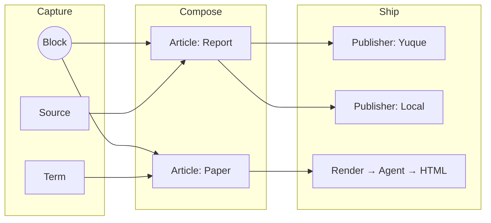
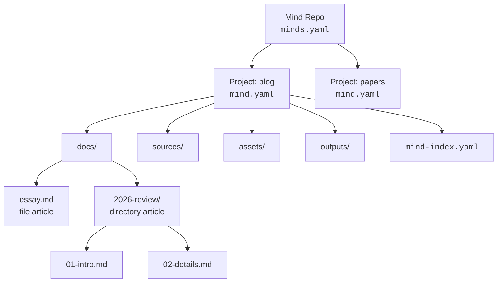
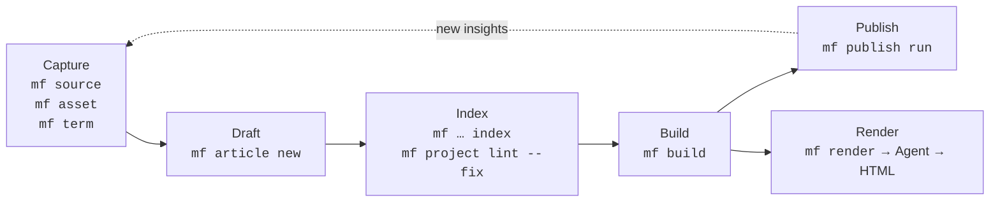

# mind-forge

**A local-first, AI-native CLI for card-based writing.**

`mf` treats your knowledge base as a codebase. Articles are assembled from
composable Blocks, every piece of state lives in plain files on disk, and the
CLI is shaped so both humans and Agents can drive it.

## Philosophy

Three ideas guide every decision in `mf`:

### Diffusion

Knowledge is meant to spread. Capture it once as a Block, then let it
diffuse — through articles, glossary terms, builds, and downstream
publishers like Yuque or static sites. The same atomic unit can land in a
report today and a paper tomorrow, without copy-paste drift.



### DaC — Document as Code

Your writing follows the same discipline as your infrastructure:

declarative YAML configs (`minds.yaml`, `mind.yaml`, `mind-index.yaml`),
schema validation, deterministic builds, and full git auditability.
If you can review a PR, you can review a chapter.

### AI Native CLI

`mf` is designed first for AI Agents, not for human terminal sessions.
Every command speaks a JSON envelope (`{ status, command, data }`), exits
with stable codes, and ships prompt-emitting subcommands like `mf render`
that produce Agent-facing instructions instead of guessing at output.
Build a pipeline with shell, Make, or an LLM — the contract is the same.

This is an independent philosophy, not a subset of DaC: AI Native CLI
rejects interactive prompts, colored output designed for human eyes, and
inconsistent exit codes. The tool is a reliable API for an LLM to call.

Local-first underpins all three: no cloud, no lock-in, plain markdown and
YAML you can edit in any editor.

## Install

Requires Rust 1.75+.

```bash
git clone https://github.com/alswl/mind-forge.git
cd mind-forge
cargo install --path .
```

Or run from source while iterating:

```bash
cargo run -- --help
```

Shell completion:

```bash
mf --install-completion zsh   # or bash | fish | powershell | elvish
```

## Quick Start

```bash
# 1. Initialize a Mind Repo
mkdir my-repo && cd my-repo
mf config init                       # creates minds.yaml

# 2. Create a project and a default blank directory article
mf project new blog
mf article new "First Post" --project blog

# 3. Add a source and an asset
mf source add https://example.com/ref --file-kind web --project blog
mf asset add diagram.png --project blog

# 4. Index, build, and publish
mf article index --project blog
mf build "First Post" --project blog
mf publish run "First Post" --target local --project blog

# 5. Hand off to an Agent for HTML rendering
mf render "First Post" --template report --project blog
```

## Core Concepts

| Concept          | What it is                                                                 |
| ---------------- | -------------------------------------------------------------------------- |
| **Mind Repo**    | A directory rooted at `minds.yaml`. The outermost unit of organization.    |
| **Project**      | A subdirectory with `mind.yaml`. Default layout: `docs/`, `sources/`, `assets/`, `templates/`, `outputs/`. |
| **Article**      | A document — either a single Markdown file or a directory of ordered files. |
| **Block**        | An atomic, reusable unit of content composed into articles.                |
| **Source**       | An external reference (web page, PDF, RSS feed, file) tracked per project. |
| **Asset**        | A binary or non-text resource attached to a project.                       |
| **Index**        | `mind-index.yaml` per project — the source of truth for everything above.  |
| **Publisher**    | A target (e.g. `local`, `yuque-prompt`) that ships built output somewhere. |
| **Render**       | An Agent-facing prompt that turns built Markdown into HTML via a template. |

All on-disk YAML follows the mind 0.3.0 format (`schema: "1"`), so repos move
freely between `mf` and other mind-compatible tools.

How the pieces fit on disk:



## Workflow

A typical loop:



1. **Capture** — `mf source add` and `mf asset add` pull raw material into a
   project. `mf term new` records vocabulary.
2. **Draft** — `mf article new <TITLE> [--template <S>] [--file|--single-file]`
   scaffolds a directory article (default) or single file (`--file`/`--single-file`) under
   `docs/`. The default template is `blank`; `--template arch|prd|blog`
   selects another built-in scaffold, and `--template <path>` reads a
   project-local Markdown template. New articles automatically get Typora
   front matter (`typora-copy-images-to`) pointing to the project assets
   directory (disable with `plugins.typora-front-matter.enabled: false` in
   `mind.yaml`). Edit in any Markdown editor.
3. **Index** — `mf source index`, `mf article index`, and
   `mf project lint --fix` reconcile `mind-index.yaml` with the filesystem.
4. **Build** — `mf build <article>` assembles output (directory articles
   merge their files in filename order) into `outputs/<article>.md`.
5. **Ship** — `mf publish run … --target <publisher>` pushes to a configured
   target, or `mf render` produces an HTML-rendering prompt for an Agent.

Every step is idempotent and pipe-friendly. Pass `--json` to any command to
get a machine-readable envelope.

## Features

- **Project lifecycle** — `mf project new | list | status | lint | index | archive | rename | import | show`
- **Article management** — `mf article new <TITLE> [--template <S>] [--file|--single-file]`,
  plus `list | lint | index | rename`; new articles are directory articles by
  default, use the `blank` template unless `--template blank|arch|prd|blog` or
  a custom project-local template path is supplied, and `--file`/`--single-file`
  opts into the single-file shape
- **Sources** — `mf source add | list | update | index | remove | clean`,
  file kinds `auto`, `pdf`, `file`, `rss`, `web`
- **Assets** — `mf asset add | list | update | index | remove | clean`
- **Glossary** — `mf term new | list | show | lint | fix | learn`
- **Build** — config-driven assembly, directory-article merging,
  `--dry-run`, `--output`, and `@path/`-style article addressing
- **Publish** — `mf publish run | update` against per-target publishers
  (`local`, `yuque-prompt`, …) plus repo-wide `mf publisher list`
- **Render prompts** — `mf render <article>` emits an Agent-facing HTML
  rendering prompt using built-in templates (`report`, `paper`) or custom
  Markdown templates under `.mind-forge/renders/`; `--html-form` switches
  between document and fragment output shapes
- **Config** — `mf config schema | show | generate | default | init`,
  centralized defaults for `docs/`, `sources/`, `assets/`, `_archived/`,
  and `outputs/`
- **Plugins** — `mind.yaml` supports a `plugins` block for forward-compatible
  plugin configuration; the `typora-front-matter` plugin is enabled by default
  and injects `typora-copy-images-to` front matter into new articles so Typora
  saves pasted images to the project assets directory automatically
- **Compatibility** — reads and writes mind 0.3.0 YAML; tolerates older
  `schema_version` and list-based shapes on read
- **Version** — `mf version` outputs the current CLI version in text (`mf 0.1.0`) or
  JSON (`{ status, command, data: { version } }`) format; works from any directory
  without a Mind Repo
- **Release workflow** — push a valid `v<MAJOR>.<MINOR>.<PATCH>` tag to trigger
  cross-platform builds (Linux x86_64/aarch64, macOS aarch64) and create a GitHub
  Releases draft for maintainer review before publishing
- **Output contract** — `text` by default, `--json` for `{ status, command, data }`
  envelopes; stable exit codes; shell completion via `mf completion <shell>`

## Migrating from `mind`

- [Migration guide](docs/migration-from-mind.md) — command mapping table
- [Deprecations](docs/deprecations.md) — deprecated usages and their replacements
- [mf extensions](docs/mf-extensions.md) — `mf`-only commands

## Project Status

See [ROADMAP](specs/002-mf-command-design/ROADMAP.md) for the feature
evolution plan and [specs/](specs/) for detailed specifications.

## License

[MIT](LICENSE)
