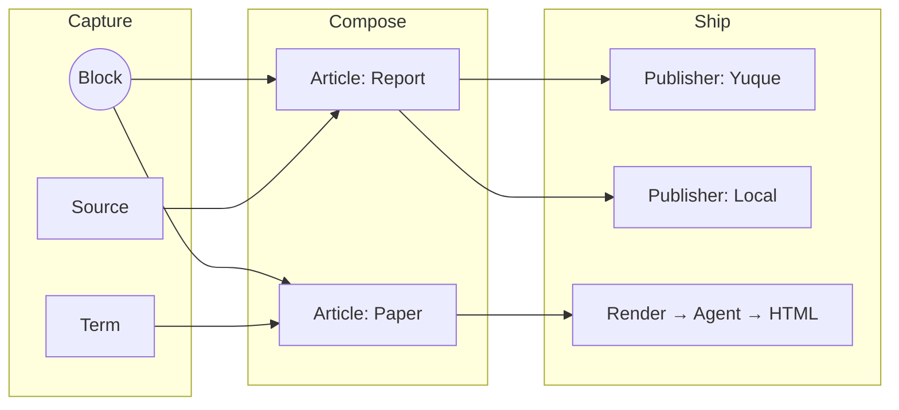
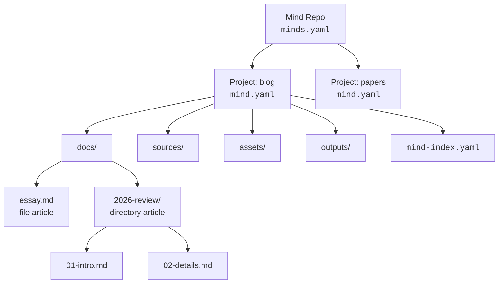
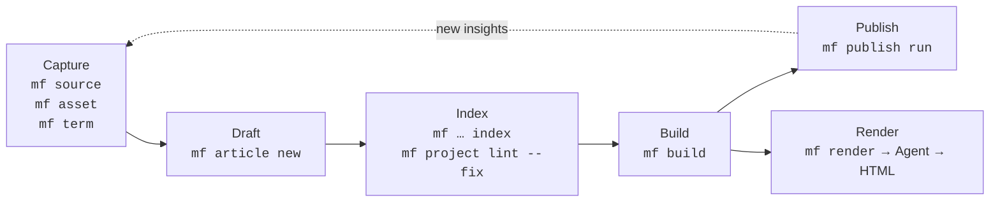

# mind-forge

**A local-first, AI-native CLI for card-based writing.**

`mf` treats your knowledge base as a codebase. Articles are assembled from
composable Blocks, every piece of state lives in plain files on disk, and the
CLI is shaped so both humans and Agents can drive it.

## Philosophy

Three ideas guide every decision in `mf`:

### Diffusion

Knowledge is meant to spread. Capture it once as a Block, then let it
diffuse — through articles, glossary terms, builds, and downstream
publishers like Yuque or static sites. The same atomic unit can land in a
report today and a paper tomorrow, without copy-paste drift.



### DaC — Document as Code

Your writing follows the same discipline as your infrastructure:

declarative YAML configs (`minds.yaml`, `mind.yaml`, `mind-index.yaml`),
schema validation, deterministic builds, and full git auditability.
If you can review a PR, you can review a chapter.

### AI Native CLI

`mf` is designed first for AI Agents, not for human terminal sessions.
Every command speaks a JSON envelope (`{ status, command, data }`), exits
with stable codes, and ships prompt-emitting subcommands like `mf render`
that produce Agent-facing instructions instead of guessing at output.
Build a pipeline with shell, Make, or an LLM — the contract is the same.

This is an independent philosophy, not a subset of DaC: AI Native CLI
rejects interactive prompts, colored output designed for human eyes, and
inconsistent exit codes. The tool is a reliable API for an LLM to call.

Local-first underpins all three: no cloud, no lock-in, plain markdown and
YAML you can edit in any editor.

## Install

Requires Rust 1.75+.

```bash
git clone https://github.com/alswl/mind-forge.git
cd mind-forge
cargo install --path .
```

Or run from source while iterating:

```bash
cargo run -- --help
```

Shell completion:

```bash
mf completion zsh   # or bash | fish | powershell | elvish
```

## Quick Start

```bash
# 1. Initialize a Mind Repo
mkdir my-repo && cd my-repo
mf init                              # creates minds.yaml and projects/

# 2. Create a project and a default blank directory article
mf project new blog
mf article new "First Post" --project blog

# 3. Add a source and an asset
mf source add https://example.com/ref --file-kind web --project blog
mf asset add diagram.png --project blog

# 4. Index, build, and publish
mf article index --project blog
mf build "First Post" --project blog
mf publish run "First Post" --target local --project blog

# 5. Hand off to an Agent for HTML rendering
mf render "First Post" --template report --project blog
```

## Core Concepts

| Concept          | What it is                                                                 |
| ---------------- | -------------------------------------------------------------------------- |
| **Mind Repo**    | A directory rooted at `minds.yaml`. The outermost unit of organization.    |
| **Project**      | A subdirectory with `mind.yaml`. Default layout: `docs/`, `sources/`, `assets/`, `templates/`, `outputs/`. |
| **Article**      | A document — either a single Markdown file or a directory of ordered files. |
| **Block**        | An atomic, reusable unit of content composed into articles.                |
| **Source**       | An external reference (web page, PDF, RSS feed, file) tracked per project. |
| **Asset**        | A binary or non-text resource attached to a project.                       |
| **Index**        | `mind-index.yaml` per project — the source of truth for everything above.  |
| **Publisher**    | A target (e.g. `local`, `yuque-prompt`) that ships built output somewhere. |
| **Render**       | An Agent-facing prompt that turns built Markdown into HTML via a template. |

All on-disk YAML follows the mind 0.3.0 format (`schema: "1"`), so repos move
freely between `mf` and other mind-compatible tools.

How the pieces fit on disk:



## Workflow

A typical loop:



1. **Capture** — `mf source add` and `mf asset add` pull raw material into a
   project. `mf term new` records vocabulary.
2. **Draft** — `mf article new <TITLE> [--template <S>] [--file]`
   scaffolds a directory article (default) or single file (`--file`) under
   `docs/`. The default template is `blank`; `--template arch|prd|blog`
   selects another built-in scaffold, and `--template <path>` reads a
   project-local Markdown template. New articles automatically get Typora
   front matter (`typora-copy-images-to`) pointing to the project assets
   directory (disable with `plugins.typora-front-matter.enabled: false` in
   `mind.yaml`). Edit in any Markdown editor.
3. **Index** — `mf source index`, `mf article index`, and
   `mf project lint --fix` reconcile `mind-index.yaml` with the filesystem.
4. **Build** — `mf build <article>` assembles output (directory articles
   merge their files in filename order) into `outputs/<article>.md`.
5. **Ship** — `mf publish run … --target <publisher>` pushes to a configured
   target, or `mf render` produces an HTML-rendering prompt for an Agent.

Every step is idempotent and pipe-friendly. Pass `--json` to any command to
get a machine-readable envelope.

## Global Flags

| Flag | Description |
|------|-------------|
| `--root <PATH>` | Mind Repo root directory |
| `--config <PATH>` | Config file path |
| `-p`, `--project <NAME>` | Project name for project-scoped operations |
| `-v`, `--verbose...` | Verbose output (repeatable) |
| `-q`, `--quiet` | Silence non-error output |
| `--format <text\|json>` | Output format (default: `text`) |
| `--json` | Shorthand for `--format json` |
| `--no-color` | Disable colored output |
| `--install-completion <SHELL>` | Install shell completion script |
| `--show-completion <SHELL>` | Show shell completion script |
| `-h`, `--help` | Show help |
| `-V`, `--version` | Show version |

`--project` can be placed before or after the subcommand: both
`mf --project blog article list` and `mf article list --project blog` work.

## Commands

### `mf init [PATH]`

Initialize a directory as a Mind Repo. Creates `minds.yaml` and the default
`projects/` container. Accepts an existing valid repo (idempotent) or an
empty directory. Refuses non-empty directories, nested repos, file targets,
and path traversal.

### `mf project`

| Subcommand | Description |
|-----------|-------------|
| `new <NAME> [--template <T>] [--force]` | Create a project |
| `list` (ls) | List projects |
| `archive <NAME>` | Move project to `_archived/` |
| `lint [--fix] [--rule <R>]` | Lint project(s); `--fix` auto-corrects |
| `index [--dry-run]` | Index projects |
| `show <PROJECT>` | Show project details |
| `import <DIR> [--type <T>] [--source <D>] [--assets <D>] [-f] [-y]` | Import a directory as a project |
| `rename <OLD> <NEW>` | Rename a project |
| `remove <NAME>` (rm) | Remove a project |

### `mf article`

| Subcommand | Description |
|-----------|-------------|
| `new <TITLE> [-t blank\|arch\|prd\|blog] [--file] [--tag <T>] [--draft] [-f]` | Create an article (directory by default; `--file` for single file) |
| `list` (ls) | List articles |
| `lint [--fix]` | Lint articles |
| `index [--dry-run]` | Index articles |
| `rename <OLD> <NEW> [-f]` | Rename an article |
| `remove <TITLE>` (rm) | Remove an article (`--dry-run`, `--force`) |
| `show <TITLE>` | Show article details |

### `mf source`

| Subcommand | Description |
|-----------|-------------|
| `add <INPUT> [-n <NAME>] [--file-kind <K>] [--source-kind <K>] [--link] [-f]` | Add a source |
| `list` (ls) | List sources (`--filter`, `-t`) |
| `update <NAME> [--url <U>]` | Update a source |
| `index [--dry-run]` | Index sources |
| `rename <OLD> <NEW> [-f] [--dry-run]` | Rename a source |
| `remove <NAME>` (rm) | Remove a source (`--keep-file` keeps file on disk) |
| `clean [--dry-run]` | Clean stale index entries |

`--file-kind`: `auto`, `pdf`, `file`, `rss`, `web`.
`--source-kind`: `yuque`, `meeting`, `misc`.

### `mf asset`

| Subcommand | Description |
|-----------|-------------|
| `add <PATH> [--name <N>] [--tag <T>] [--copy\|--link] [-f]` | Add an asset |
| `list` (ls) | List assets (`--filter`, `--type image\|video\|audio\|other`) |
| `update [PATH] [--set-url <U>] [--channel <C>] [--all]` | Update assets |
| `index [--dry-run] [--refresh-metadata]` | Index assets |
| `clean [--dry-run]` | Clean stale index entries |
| `remove <FILE>` (rm) | Remove an asset (`--force`) |
| `rename <OLD> <NEW> [-f] [--dry-run]` | Rename an asset |
| `show <NAME>` | Show asset details |

### `mf term` (alias: `mf terms`)

| Subcommand | Description |
|-----------|-------------|
| `new <TERM> [--definition <T>] [--description <T>] [--confidence <N>] [--alias <A>] [--tag <T>] [--misrecognition <P>]` | Create a term |
| `list` (ls) | List terms (`--filter`) |
| `lint [--fix] [--dry-run]` | Lint term usage in project docs |
| `add --term <T> --alias <A>` | Add a term correction |
| `update <TERM> [--definition <T>] [--description <T>\|--clear-description] [--confidence <N>\|--clear-confidence] [--alias <A>] [--tag <T>]` | Update term metadata |
| `show <NAME>` | Show term details |
| `remove <NAME>` (rm) | Remove a term |
| `rename <OLD> <NEW>` | Rename a term |

Global terms (created without `--project`) are stored in `minds-terms.yaml` at
the repo root. Project-scoped terms live in each project's `mind-index.yaml`.
`--misrecognition` is for global terms only. `--confidence` is a float from 0.0
to 1.0.

### `mf build <ARTICLE>`

Build/assemble an article. `-o`, `--output <PATH>`; `--dry-run`. `ARTICLE` may
be an indexed name/slug or a repo-relative path prefixed with `@` (e.g.
`@projects/blog/docs/2026-03-review/`). Directory articles are built by merging
Markdown files in filename order.

### `mf publish`

| Subcommand | Description |
|-----------|-------------|
| `run <ARTICLE> --target <T> [--dry-run] [-f]` | Publish to a target |
| `update <ARTICLE> --target <T> [--set KEY=VALUE] [--status <S>] [--target-url <U>] [--dry-run]` | Update publish record |
| `target list` | List publish targets and diagnostics |

### `mf render [ARTICLE]`

Generate an Agent-facing HTML rendering prompt. `--template <NAME>` selects
a render template (built-in: `report`, `paper`; or custom under
`.mind-forge/renders/`). `--html-form document|fragment` chooses output shape.

| Subcommand | Description |
|-----------|-------------|
| `template list` | List available render templates |

### `mf config`

| Subcommand | Description |
|-----------|-------------|
| `schema [--output-format json\|yaml]` | Show config JSON schema |
| `show [--output-format json\|yaml]` | Show effective config |
| `generate [--output-format json\|yaml] [-o <PATH>]` | Generate effective config file |
| `default [--output-format json\|yaml]` | Show default config values |
| `init` | Deprecated — use `mf init` instead |

### `mf completion <SHELL>`

Generate shell completion script for `bash`, `zsh`, `fish`, `powershell`, or `elvish`.

### `mf version`

Show version information. Accepts `--json` for machine-readable output.

## Features

- **Repo lifecycle** — `mf init [PATH]` creates a Mind Repo (`minds.yaml`
  plus the default `projects/` container); refuses to overwrite existing
  content or nest inside an existing Mind Repo
- **Project lifecycle** — `mf project new | list | archive | lint | index | show | import | rename | remove`
- **Article management** — `mf article new | list | lint | index | show | rename | remove`;
  directory articles by default, `--file` for single-file shape;
  `--template blank|arch|prd|blog` or a custom project-local template path
- **Sources** — `mf source add | list | update | index | rename | remove | clean`;
  `--file-kind auto|pdf|file|rss|web`, `--source-kind yuque|meeting|misc`
- **Assets** — `mf asset add | list | update | index | clean | remove | rename | show`;
  `--copy`/`--link` for copy vs symlink
- **Glossary** — `mf term new | list | show | lint | add | update | remove | rename`;
  `--description` and `--confidence` (0.0–1.0) metadata for richer automation hints
- **Build** — config-driven assembly, directory-article merging,
  `--dry-run`, `--output`, and `@path/`-style article addressing
- **Publish** — `mf publish run | update | target list` against per-target
  publishers (`local`, `yuque-prompt`, …)
- **Render prompts** — `mf render` emits an Agent-facing HTML rendering prompt
  using built-in templates (`report`, `paper`) or custom Markdown templates
  under `.mind-forge/renders/`; `--html-form document|fragment`
- **Config** — `mf config schema | show | generate | default`;
  centralized defaults for `docs/`, `sources/`, `assets/`, `_archived/`,
  and `outputs/`
- **Plugins** — `mind.yaml` supports a `plugins` block for forward-compatible
  plugin configuration; the `typora-front-matter` plugin is enabled by default
  and injects `typora-copy-images-to` front matter into new articles
- **Compatibility** — reads and writes mind 0.3.0 YAML; tolerates older
  `schema_version` and list-based shapes on read
- **Shell completion** — `mf completion <SHELL>` for bash, zsh, fish,
  powershell, elvish; `--install-completion` / `--show-completion` global flags
- **Version** — `mf version` outputs the current CLI version in text or JSON
- **Output contract** — `text` by default, `--json` for
  `{ status, command, data }` envelopes; stable exit codes

## Project Status

See [specs/](specs/) for detailed specifications and the feature evolution plan.

## License

[MIT](LICENSE)
