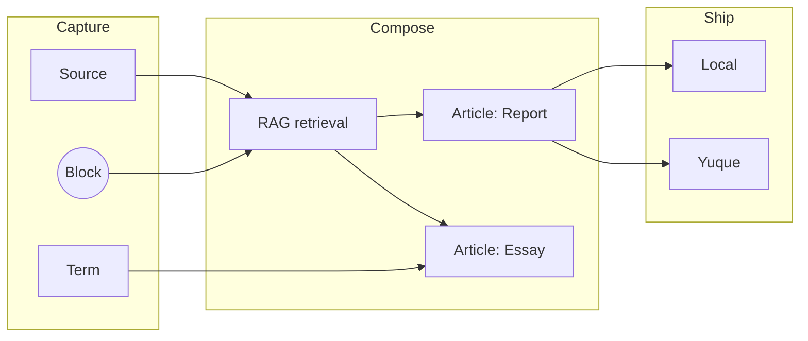
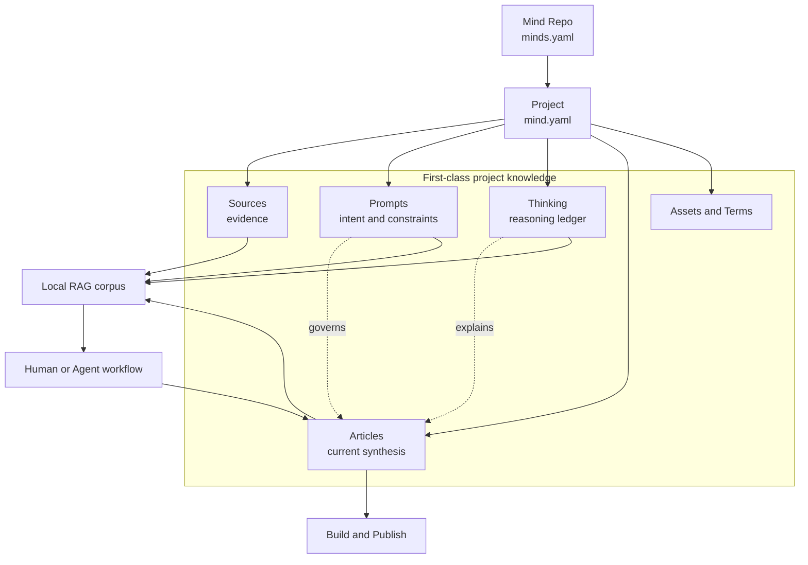

# mind-forge

**A local-first, AI-native CLI for card-based writing and personal knowledge.**

`mf` manages Markdown articles, Sources, assets, terms, builds, publishing,
and a repository-wide local RAG corpus. Authored files stay plain and
Git-reviewable; the RAG index is rebuildable derived state.

`mind-forge` treats a knowledge base like a codebase: capture evidence once,
compose it into different articles, and ship it through repeatable workflows.
The CLI is designed to be driven equally well by a person, a script, or an AI
Agent.

## Philosophy

Four ideas shape the product.

### Diffusion

Knowledge should move instead of being copied. A Source, term, or reusable
Block can contribute to several articles; an article can then flow to several
publishers. The repository preserves the connections so the same idea can
evolve without creating disconnected copies.


```mermaid
flowchart LR
  subgraph Capture
    S[Source]
    B((Block))
    T[Term]
  end
  subgraph Compose
    R[RAG retrieval]
    A1[Article: Report]
    A2[Article: Essay]
  end
  subgraph Ship
    P1[Local]
    P2[Yuque]
  end
  S --> R
  B --> R
  T --> A2
  R --> A1
  R --> A2
  A1 --> P1
  A1 --> P2
```

RAG is part of this diffusion path: it helps find existing knowledge and its
provenance before new prose is written.

### Document as Code

Writing deserves the same engineering discipline as software:

- Markdown and YAML are the durable interfaces;
- schemas and lint rules make structure explicit;
- deterministic builds turn sources into outputs;
- Git records the history of both content and decisions.

If a code change can be reviewed as a diff, a chapter should be reviewable the
same way. Derived indexes and build products must never replace authored files.

### AI Native CLI

An Agent should not need to scrape colorful terminal prose or guess whether a
command succeeded. `mf` exposes stable JSON envelopes, predictable exit codes,
canonical identities, dry-run support, and explicit confirmation boundaries.

This is more than “CLI automation.” The command surface is an API for reasoning
systems: deterministic enough to compose, inspect, retry, and audit.

### Local first

The repository remains useful without a required cloud service. Authored
content stays in ordinary files, secrets stay outside committed configuration,
and the embedded RAG corpus can be rebuilt locally. Optional external services
extend the workflow; they do not own it.

## Install

Requires Rust 1.91+.

```bash
git clone https://github.com/alswl/mind-forge.git
cd mind-forge
cargo install --path .
```

## Quick start

```bash
mkdir my-repo && cd my-repo
mf init
mf project new notes
mf article new "First Note" --project notes
mf source new ./reference.pdf --file-kind pdf --project notes

# Build and query the repository-wide RAG corpus
mf source sync --offline
mf search "what I am investigating" --output json

mf article index --project notes
mf build "First Note" --project notes
```

See [docs/manual.md](docs/manual.md) for the full manual.

## Mind Repo model

A Mind Repo is more than a folder of finished documents. Each article is
supported by four first-class knowledge stores:

| Store | Responsibility |
|---|---|
| **Sources** | Evidence and provenance: what the work can rely on. |
| **Prompts** | The control plane: objective, mode, audience, constraints, criteria, and durable decisions. |
| **Thinking** | The working ledger: reasoning, conflicts, assumptions, feedback, blockers, and follow-ups. |
| **Articles** | The current user-readable synthesis or deliverable. |

Prompt and Thinking are authored Markdown, not transient chat context. A Prompt
binds to an Article through its declared `article` field; a Thinking ledger
associates by article key. `mf article list` and `show` expose both relationships,
while `mf article index` reconciles their projections after manual edits.


```mermaid
flowchart TD
  Repo[Mind Repo<br/>minds.yaml]
  Repo --> Project[Project<br/>mind.yaml]

  subgraph Knowledge[First-class project knowledge]
    Sources[Sources<br/>evidence]
    Prompts[Prompts<br/>intent and constraints]
    Thinking[Thinking<br/>reasoning ledger]
    Articles[Articles<br/>current synthesis]
    Support[Assets and Terms]
  end

  Project --> Sources
  Project --> Prompts
  Project --> Thinking
  Project --> Articles
  Project --> Support

  Prompts -. governs .-> Articles
  Thinking -. explains .-> Articles
  Sources --> RAG[Local RAG corpus]
  Prompts --> RAG
  Thinking --> RAG
  Articles --> RAG
  RAG --> Work[Human or Agent workflow]
  Work --> Articles
  Articles --> Build[Build and Publish]
```

The separation is deliberate: Prompt preserves intent, Thinking preserves the
path taken, Sources preserve evidence, and Article preserves the result. RAG
connects all four without collapsing their ownership boundaries.

## Core workflow

```text
set intent → capture evidence → reason → sync/search → write → build → publish
```

- `prompts/<key>.md` defines the article's objective and constraints.
- `thinking/<key>.md` records reasoning and work state as they evolve.
- `mf source new` records evidence with provenance.
- `mf source sync --offline` initializes or refreshes the local corpus.
- `mf search <QUERY>` searches Sources, Prompts, Thinking, and Article content.
- `mf article`, `mf build`, and `mf publish` manage the writing pipeline.

## Source RAG

### Canonical search

```bash
mf source sync --offline
mf search "topic or claim" --output json --limit 20
mf search "topic" --project notes --source reference
mf source status --output json
```

`mf search` is the canonical global retrieval command. It has no `--mode`
flag and searches registered Sources, article prose, Prompts, and Thinking.
Results include provenance; verify the returned project, Source identity, and
location before citing a result.

`mf source search --mode ...` is retained only for old scripts. New workflows
should use `mf search`.

### Source dual-write

When RAG is active, `mf source new` performs a deliberate dual write:

1. Lance receives the authoritative Source registration first.
2. The project's `mind-index.yaml` receives a compatibility projection.

A projection warning does not mean the primary Source was lost. Run
`mf source sync` to reconcile it. Repositories without RAG remain legacy-only
until their first successful sync.

Sync is local-first and non-destructive. It reads saved local Source files and
discovers article prose, `prompts/`, and `thinking/` by default. Unchanged
content is synchronized idempotently.

### Maintenance and bundles

```bash
mf source admin rebuild --offline
mf source admin clear --dry-run
mf source admin recover --snapshot <ID> --dry-run
mf source export --output-dir ./backup.mfbundle
mf source import ./backup.mfbundle --dry-run
mf source trace
```

The old `source advanced` command tree and terminal enrichment workflow are
removed. Existing enrichment data is not deleted by sync or maintenance.

Optional semantic embeddings use an OpenAI-compatible `/v1/embeddings`
provider. Credentials belong in environment variables or the gitignored
`minds-secrets.yaml`, never in committed configuration.

## Repository layout

```text
my-repo/
├── minds.yaml
├── projects/
│   └── notes/
│       ├── mind.yaml
│       ├── mind-index.yaml
│       ├── docs/
│       ├── sources/
│       ├── prompts/        # intent and control plane
│       ├── thinking/       # reasoning and work ledger
│       └── outputs/
└── .mind-forge/cache/source/advanced/  # rebuildable RAG state
```

`minds.yaml` describes the repository; `mind.yaml` describes a project;
`mind-index.yaml` is the project compatibility/index projection.

## Command groups

```text
mf init
mf project new|list|show|update|rename|remove|archive|lint|index|import
mf article new|list|show|update|rename|remove|lint|convert|index
mf source new|list|show|update|rename|remove|index|clean
mf source sync|status|export|import|trace
mf source admin rebuild|clear|recover
mf search <QUERY>
mf asset ...     mf term ...     mf build ...
mf publish ...   mf render ...   mf config ...
```

Use `mf <command> --help` for current flags. Most commands support
`--project`, `--output text|json`, `--json`, and `--dry-run` where applicable.

## Output and safety

JSON commands use `{ "status", "command", "data" }` envelopes. Exit codes are:

- `0` success;
- `1` runtime/storage failure;
- `2` invalid input or rejected operation.

Read-only retrieval does not modify authored files. Destructive operations
require explicit confirmation; use `--dry-run` before changing unfamiliar data.

## Development

```bash
cargo fmt --check
cargo clippy -- -D warnings
cargo test
```

Feature specifications live under `specs/`. Commits use conventional commit
messages.

## License

[MIT](LICENSE)
