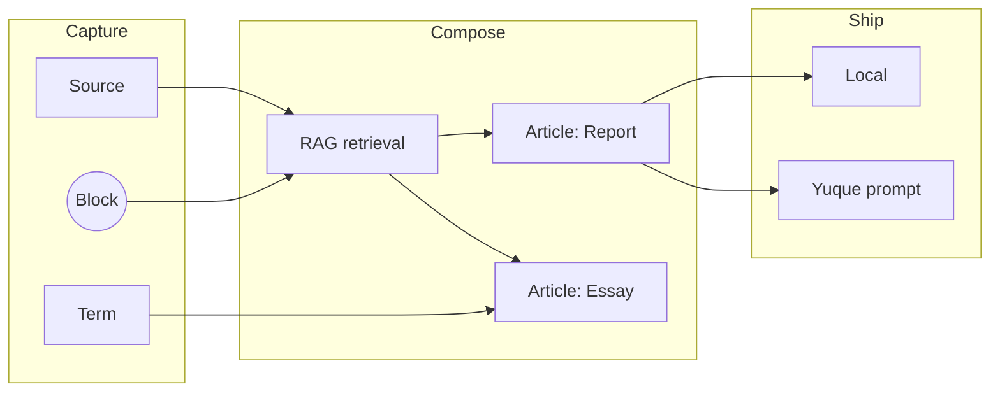
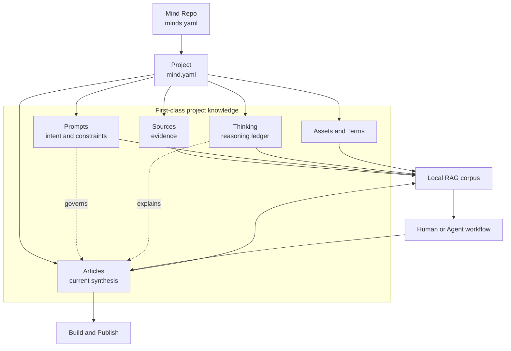

# mind-forge

[](https://github.com/alswl/mind-forge/actions/workflows/ci.yml)
[](https://github.com/alswl/mind-forge/releases)


**A local-first, AI-native CLI for card-based writing and personal knowledge.**

`mf` treats a knowledge base like a codebase. You capture evidence once, write
several articles from it, and ship them through repeatable build and publish
steps. Everything you author is plain Markdown and YAML that Git can diff and
review. The search index is derived state and can be rebuilt locally at any
time. A person, a shell script and an AI agent can all drive the CLI the same
way.

- **Four knowledge stores.** Sources (evidence), Prompts (intent), Thinking
  (reasoning) and Articles (synthesis) are all first-class.
- **Repository-wide local RAG.** `mf search` covers Sources, articles, prompts,
  thinking, project goals and terms. Every hit says where it came from.
- **Card-based articles.** Directory articles are ordered blocks that you can
  create, move, renumber and rename.
- **Deterministic builds.** Blocks merge into one output, private content is
  stripped, and an opt-in asset pipeline (for example `d2 → svg → png`) runs.
- **Publishing.** Built articles go to local or prompt-based targets, and
  publish records are tracked.
- **Terminology control.** A shared glossary drives lint and safe batch fixes
  for transcription errors.
- **Agent contract.** Commands return single JSON envelopes, use fixed exit
  codes, support `--dry-run` and stop at explicit confirmation boundaries.
- **Agent skills.** Claude Code skills for planning, writing and CLI reference
  ship with the repo.

## Philosophy

Four ideas shape the product.

### Diffusion

Knowledge should move instead of being copied. A Source, term, or reusable
Block can contribute to several articles; an article can then flow to several
publishers. The repository preserves those connections — including the RAG path
that finds existing knowledge and its provenance before new prose is written.


```mermaid
flowchart LR
  subgraph Capture
    S[Source]
    B((Block))
    T[Term]
  end
  subgraph Compose
    R[RAG retrieval]
    A1[Article: Report]
    A2[Article: Essay]
  end
  subgraph Ship
    P1[Local]
    P2[Yuque prompt]
  end
  S --> R
  B --> R
  T --> A2
  R --> A1
  R --> A2
  A1 --> P1
  A1 --> P2
```

### Document as Code

Writing deserves the same engineering discipline as software:

- Markdown and YAML are the durable interfaces;
- schemas and lint rules make structure explicit;
- deterministic builds turn sources into outputs;
- reconciliation never reorders or drops entries it did not change;
- Git records the history of both content and decisions.

If a code change can be reviewed as a diff, a chapter should be reviewable the
same way. Derived indexes and build products never replace authored files.

### AI Native CLI

An Agent should not need to scrape colorful terminal prose or guess whether a
command succeeded. `mf` exposes stable single-level JSON envelopes, predictable
exit codes, canonical identities, dry-run support, and explicit confirmation
boundaries — a command surface deterministic enough to compose, inspect, retry
and audit.

### Local first

The repository remains useful without a cloud service. Authored content stays
in ordinary files, secrets stay outside committed configuration, and the
embedded RAG corpus rebuilds locally. External services extend the workflow;
they do not own it.

## Install

> [!NOTE]
> Requires Rust 1.91+. Prebuilt binaries for tagged versions are attached to
> [GitHub Releases](https://github.com/alswl/mind-forge/releases).

```bash
git clone https://github.com/alswl/mind-forge.git
cd mind-forge
scripts/install.sh
```

Use `scripts/install.sh` instead of `cargo install --path .`. The script keeps
its build directory between runs, so a reinstall rebuilds only `mf` and skips
the ~490 dependency crates.

Shell completion: `mf completion <shell>`.

## Quick start

```bash
mkdir my-repo && cd my-repo
mf init
mf project new notes
mf article new "First Note" --project notes        # creates docs/first-note/

# Capture evidence; new sources are indexed for search by default
printf '# Reference\n\nA local reference about gateways.\n' > reference.md
mf source new ./reference.md --project notes

# Sync the whole repository into the local RAG corpus, then query it
mf source sync --offline
mf search "gateways" --project notes --output json

# Assemble the article into projects/notes/outputs/first-note.md
mf build first-note --project notes
```

> [!TIP]
> `mf build` takes an article slug (`first-note`) or path (`docs/first-note`),
> and `mf publish run` takes the slug. Neither accepts the title. Run
> `mf article list` to see what is available.
>
> Commands that take an article, prompt, thinking, asset or source also accept
> a path to an existing file or directory, such as
> `mf build projects/notes/docs/first-note`, and pick the project from that
> path. `--project` still wins when given.

There is a longer offline walkthrough in [quickstart.md](quickstart.md).

## The Mind Repo model

A Mind Repo holds projects. Each project has four first-class knowledge stores
plus supporting assets and terms:

| Store | Responsibility |
|---|---|
| **Sources** | Evidence and provenance: what the work can rely on. |
| **Prompts** | The control plane: objective, audience, constraints, criteria and durable decisions. |
| **Thinking** | The working ledger: reasoning, conflicts, assumptions, feedback and follow-ups. |
| **Articles** | The current reader-facing synthesis or deliverable. |

Prompts and Thinking are authored Markdown, not throwaway chat context. A
Prompt binds to an Article through its `article` field, and a Thinking ledger
is matched by article key. `mf article show`, `mf prompt list` and
`mf thinking list` show these links.


```mermaid
flowchart TD
  Repo[Mind Repo<br/>minds.yaml]
  Repo --> Project[Project<br/>mind.yaml]

  subgraph Knowledge[First-class project knowledge]
    Sources[Sources<br/>evidence]
    Prompts[Prompts<br/>intent and constraints]
    Thinking[Thinking<br/>reasoning ledger]
    Articles[Articles<br/>current synthesis]
    Support[Assets and Terms]
  end

  Project --> Sources
  Project --> Prompts
  Project --> Thinking
  Project --> Articles
  Project --> Support

  Prompts -. governs .-> Articles
  Thinking -. explains .-> Articles
  Sources --> RAG[Local RAG corpus]
  Prompts --> RAG
  Thinking --> RAG
  Articles --> RAG
  Support --> RAG
  RAG --> Work[Human or Agent workflow]
  Work --> Articles
  Articles --> Build[Build and Publish]
```

```text
my-repo/
├── minds.yaml                  # repository config
├── projects/
│   └── notes/
│       ├── mind.yaml           # project config (build, publish, ...)
│       ├── mind-index.yaml     # index projection
│       ├── docs/               # articles
│       ├── sources/            # captured evidence
│       ├── prompts/            # intent and constraints
│       ├── thinking/           # reasoning ledger
│       └── outputs/            # build products
└── .mind-forge/cache/source/advanced/  # rebuildable RAG state
```

`minds.yaml` describes the repository; `mind.yaml` describes a project;
`mind-index.yaml` is the project compatibility/index projection.

## Workflow

```text
set intent → capture evidence → reason → sync/search → write → build → publish
```

| Step | Where / command |
|---|---|
| Set intent | `prompts/<key>.md` defines the article's objective and constraints |
| Capture evidence | `mf source new` records evidence with provenance |
| Reason | `thinking/<key>.md` records reasoning and work state as they evolve |
| Sync / search | `mf source sync --offline`, then `mf search <QUERY>` |
| Write | `mf article new`, `mf article block ...` |
| Build | `mf build <article>` |
| Publish | `mf publish run <article>` |

### Source RAG

#### Canonical search

```bash
mf source sync --offline                       # build or refresh the corpus
mf search "topic or claim" --output json --limit 20
mf search "topic" --project notes --source reference
mf source status --output json
```

`mf search` is the canonical global retrieval command. It has no `--mode`
flag and searches registered Sources, article prose, Prompts, Thinking, project
goals, and repository terms.

Every hit carries a structured `context` on each `registrations[]` entry —
repository and owning project, content kind, article status, internal
`relations`, and `imported_by` provenance for Source hits. Use it to attribute
and cite a result instead of re-deriving it. Search is read-only.

`mf source search --mode ...` is retained only for old scripts.

#### Source dual-write

When RAG is active, `mf source new` performs a deliberate dual write:

1. Lance receives the authoritative Source registration first.
2. The project's `mind-index.yaml` receives a compatibility projection.

A projection warning does not mean the primary Source was lost. Run
`mf source sync` to reconcile it. Repositories without RAG remain legacy-only
until their first successful sync. Pass `--no-index` to register a Source
without indexing it.

Sync is local-first and non-destructive. It reads saved local Source files and
discovers authored article prose (the `docs/` articles, not `outputs/` build
artifacts), `prompts/`, `thinking/`, project goals (`mind.yaml`), and repository
terms by default. Unchanged content is synchronized idempotently. The sync
report includes per-kind `coverage` and item-by-item `skipped_items` (each with
a `reason`) so nothing is silently dropped.

`mf source new` accepts `--article <PATH>` to record the originating article as
authoritative import provenance on the Source binding.

> [!WARNING]
> `mf source rename <old> <new>` now always treats `<new>` as a path
> (cwd-relative or absolute). To rename in place, give the full path including
> directory and extension, e.g. `mf source rename srcfile sources/pdf/renamed.pdf`.

#### Maintenance and bundles

```bash
mf source admin rebuild --offline
mf source admin clear --dry-run
mf source admin recover --snapshot <ID> --dry-run
mf source export --output-dir ./backup.mfbundle
mf source import ./backup.mfbundle --dry-run
mf source trace
```

The RAG storage schema is `v3`, and compatibility is read from the
`registrations` table's on-disk structure rather than a recorded version, so it
cannot go stale. A repository predating the current schema refuses
`search`/`sync` with a diagnostic; run `mf source sync --rebuild` once. No
migration shim is provided.

Lance is authoritative for Sources and `mind-index.yaml`'s `sources:` section is
a lossless projection of it; terms remain authoritative in `mind-index.yaml`.
Reconcile operations import missing registrations and never delete them
implicitly — the corpus on disk is the source of truth for recovery.

Optional semantic embeddings use an OpenAI-compatible `/v1/embeddings`
provider. Credentials belong in environment variables or the gitignored
`minds-secrets.yaml`, never in committed configuration.

### Write in blocks

```bash
mf article new "Design Review" --template arch --project notes
mf article block new design-review risks --project notes
mf article block move design-review risks --after context --project notes
mf article block renumber design-review --project notes
```

| Template | Use |
|---|---|
| `blank` | Default; a single opening block |
| `arch` | Architecture decision: context, decision, consequence, alternatives |
| `prd` | Product requirements |
| `blog` | Blog post |
| `<path>` | Any template file under the project root |

New articles are directories of numbered blocks (`01-opening.md`, ...). Pass
`--file` to create a single-file article instead; `mf article convert
--to-single-file|--to-directory` switches between the two forms.

### Build

`mf build` merges blocks in filename order and rewrites relative links so they
resolve from the output directory. It can also run an asset pipeline declared
in `mind.yaml`:

```yaml
build:
  strip_first_h1: true
  pipeline:
    - name: d2-to-svg
      input_extension: d2
      output_extension: svg
      command: "d2 {input} {output}"
    - name: svg-to-png
      input_extension: svg
      output_extension: png
      command: "rsvg-convert {input} --output {output}"
```

Only missing or stale outputs are rebuilt, and rebuilding a stage also
rebuilds the stages after it. If an optional tool is missing or fails, `mf`
prints a warning and leaves existing outputs in place. `mf build <article>
--dry-run` prints the plan without running anything.

#### Private content

Private content stays in the authored files and is still indexed for your own
RAG retrieval, but it is stripped once during assembly, so no build or publish
target ever receives it.

| Marker | Effect |
|---|---|
| `> [!mf-private]` / `> [!mind-forge-private]` callout | The callout is removed (markers inside fenced code are kept as examples) |
| Block front matter `mind-forge-visibility: private` | The whole block is skipped |

> [!IMPORTANT]
> The build fails rather than emit a titleless artifact if the first/title block
> is private, or if `mind-forge-visibility` is anything other than `public` or
> `private`. `mf article lint` reports both cases.

### Publish

```yaml
# projects/notes/mind.yaml
publish:
  default_target: local
  targets:
    - name: local
      type: local
      path: ../../published
```

```bash
mf publish run first-note --project notes --dry-run
mf publish run first-note --project notes
```

| Target type | Behavior |
|---|---|
| `local` | Copies the built article to `path` (relative paths resolve from the project directory; honors `config.prefix`) |
| `yuque-prompt` | Writes a persistent prompt file for an agent to publish to Yuque |

Without `--target`, `mf` uses `publish.default_target`. File-based publishers in
`.mind-forge/publisher/<name>.yaml` are discovered as well. Front matter is kept
by default; set `publish.strip_front_matter: true` or pass
`--strip-front-matter` for one run (`--keep-front-matter` overrides the
project setting).

`mf render <article> --template report` writes a render prompt instead of a
file. It is meant to be handed to an agent.

### Terms

```bash
mf term new "Release Note" --project notes
mf term lint --project notes
mf term fix --project notes --ad-hoc 'listnode=>Release Note' --yes
```

By default, lint and fix leave blockquotes, inline code and `「verbatim spans」`
alone. Pass `--include-quotes` when quoted text should be corrected too. See
the [term lint guide](docs/term-lint.md).

## Agent skills

[`skills/`](skills/) contains Claude Code skills for the `mf` workflow:

| Skill | Role |
|---|---|
| `mf-cli` | Full command, flag and JSON-envelope reference |
| `mf-plan` | Research, evidence comparison, outline-first planning and feedback routing |
| `mf-write` | Drafting, revision, assembly, build and explicit publishing |
| `mf-source` | Safe source registration, RAG sync and search (manual invocation) |

To install one, copy or symlink its directory into your agent's skills folder
(for example `~/.claude/skills/`). [skills/README.md](skills/README.md) explains
how the skills hand work to each other.

## Command groups

| Group | Subcommands |
|---|---|
| `mf init` | Initialize a directory as a Mind Repo |
| `mf project` | `new` `list` `show` `update` `rename` `remove` `archive` `lint` `index` `import` |
| `mf article` | `new` `list` `show` `update` `rename` `move` `remove` `lint` `index` `convert` `block` |
| `mf article block` | `new` `move` `renumber` `rename` `rm` |
| `mf prompt` / `mf thinking` | `list` `show` |
| `mf source` | `new` `list` `show` `update` `rename` `move` `remove` `index` `clean` `sync` `status` `export` `import` `trace` `search` |
| `mf source admin` | `rebuild` `clear` `recover` |
| `mf search` | Repository-wide RAG search |
| `mf asset` | `new` `list` `show` `update` `rename` `move` `remove` `index` `clean` |
| `mf term` | `new` `list` `show` `update` `rename` `move` `remove` `lint` `fix` `correction` |
| `mf term correction` | `add` `list` `show` `update` `remove` |
| `mf build` | Build an article |
| `mf publish` | `run` `update` `target list` `target show` |
| `mf render` | Render prompts; `template list` `template show` |
| `mf config` | `schema` `show` `generate` `default` `terminal` |
| `mf completion` / `mf version` | Shell completion, version info |

Use `mf <command> --help` for current flags, or the generated
[docs/manual.md](docs/manual.md) for the full reference. After changing CLI
definitions, regenerate it with `scripts/generate-manual.sh`.

## Output and safety

JSON commands use `{ "status", "command", "data" }` envelopes. Exit codes are:

| Code | Meaning |
|---|---|
| `0` | Success |
| `1` | Runtime/storage failure |
| `2` | Invalid input or rejected operation |

Global flags: `--root`, `--config`, `-p`/`--project`, `-o`/`--output text|json`,
`--json`, `-q`, `-v`, `--no-color`.

Read-only retrieval does not modify authored files. Destructive operations
require explicit confirmation; use `-n`/`--dry-run` to preview what would change
(`would index`, `would update`) before writing, and `-f`/`--force` to proceed
past a safety check. `-q` silences successful output while preserving
diagnostics and exit codes, for byte-silent automation.

## Development

```bash
cargo ck                 # fast type check while editing
cargo t1 cli_article     # run one test target
cargo test               # full suite, pre-push gate
cargo fmt --check && cargo clippy -- -D warnings
```

`mf` is one ~50k-line crate, so the full suite is the slow path.
[docs/build-workflow.md](docs/build-workflow.md) says when each tier is worth
running. Commit messages follow Conventional Commits.
